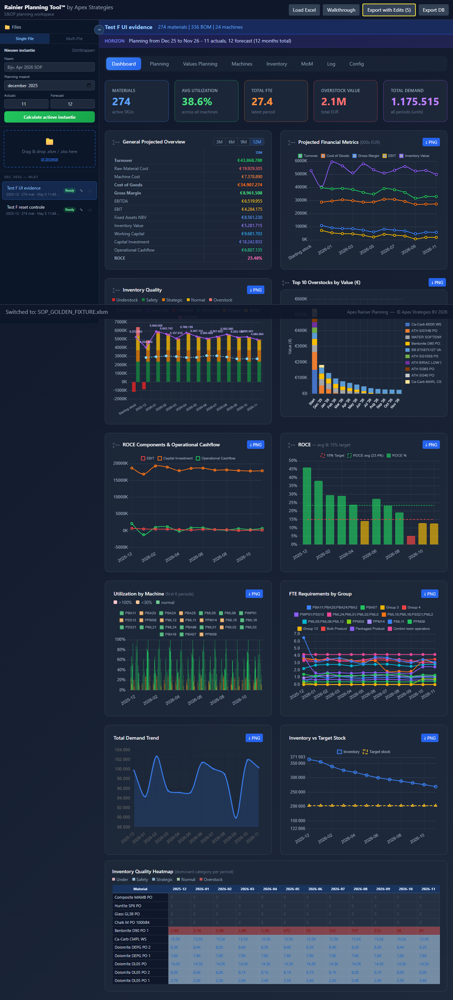
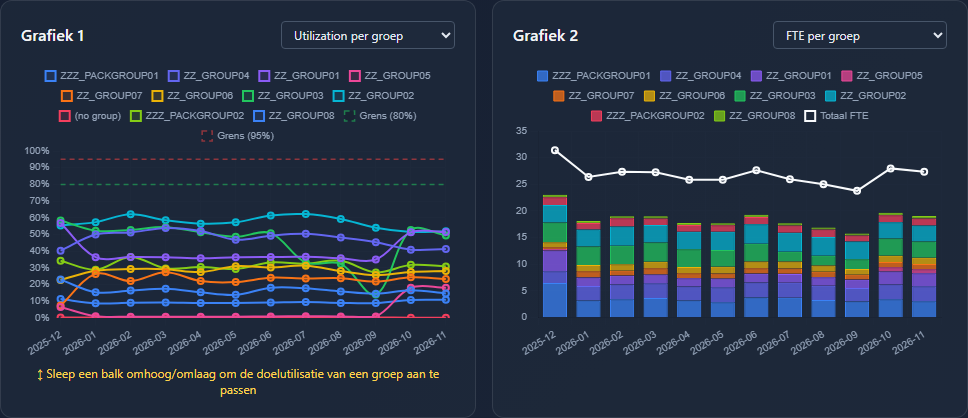
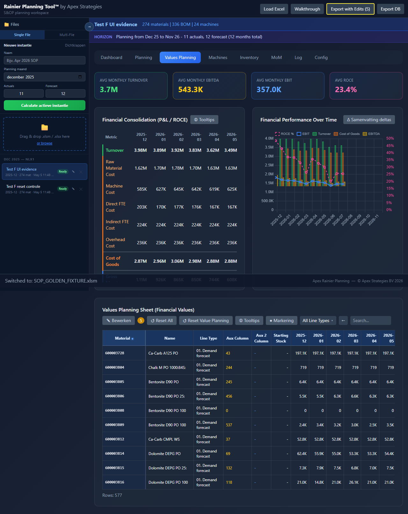
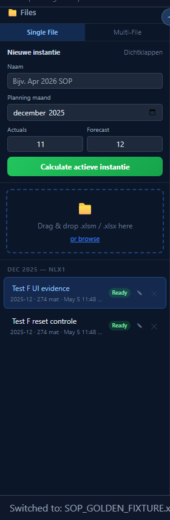
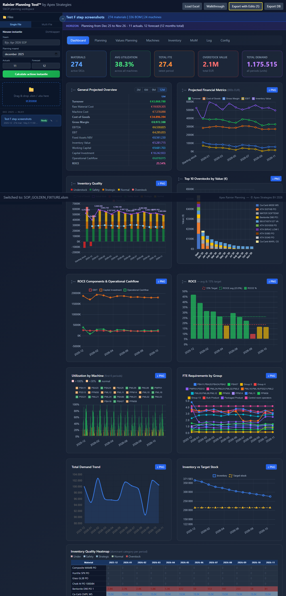
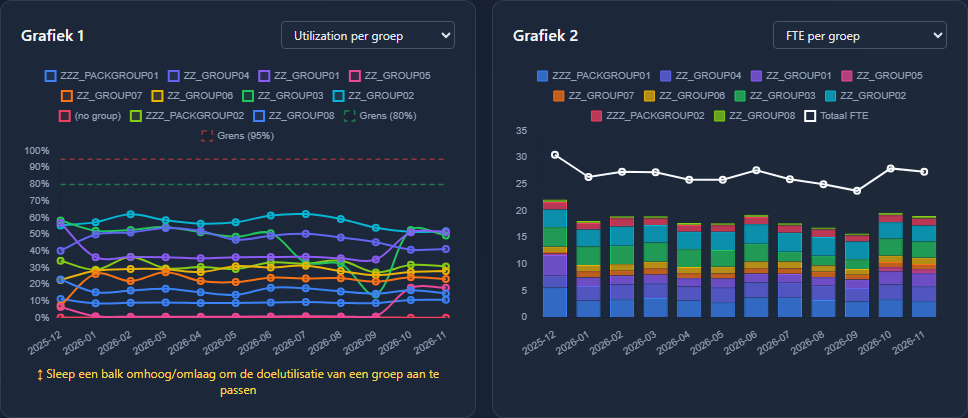
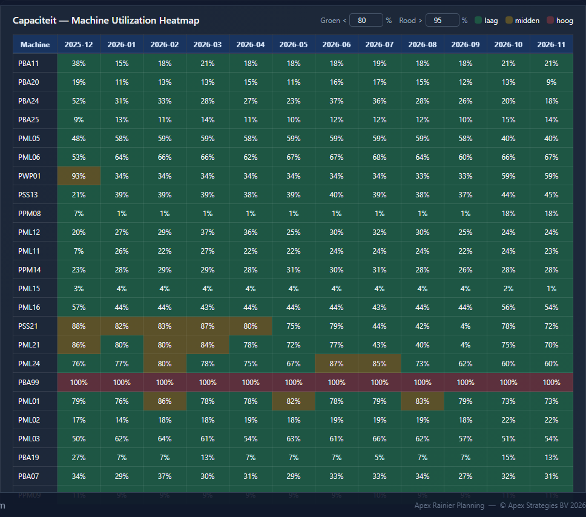
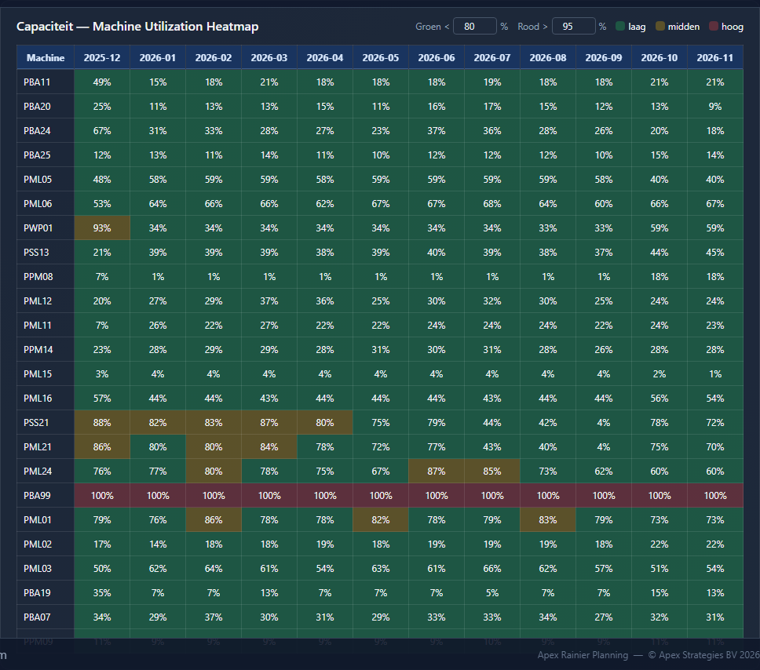
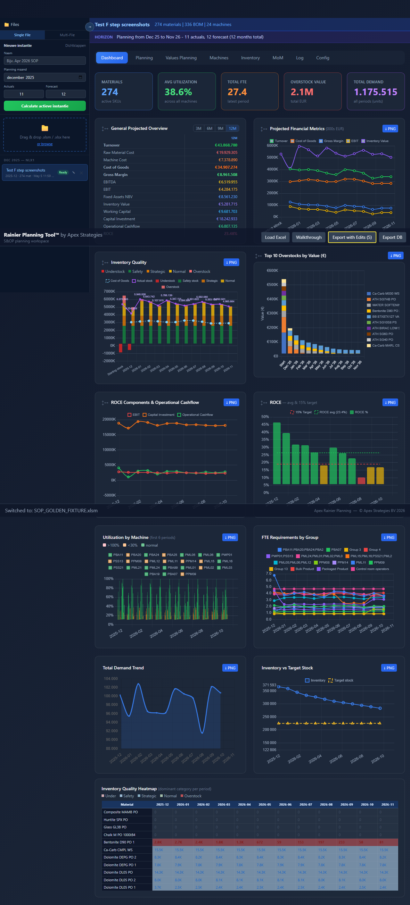

# Human Verification Test F — Nieuwe Editable Lines + Machines Tab

Datum Python-run: 2026-05-05

Doel: dezelfde edit-sequence in Python en Excel uitvoeren en controleren dat de
nieuwe editable lijnen correct doorwerken naar Planning, Machines/Capacity,
Values Planning en Dashboard.

Fixture:

```text
C:\Users\stijn\Desktop\SOP_GOLDEN_FIXTURE.xlsm
```

Belangrijke guardrail:

- PAP / purchased-and-produced is niet geladen uit deze fixture.
- Deze test gebruikt dus geen PAP-producten en neemt geen PAP-aanname over in
  Python of Excel.

## Testopzet

Deze test is cumulatief. Voer de stappen in onderstaande volgorde uit.

Python heeft de sequence uitgevoerd op:

- planning month: `2025-12`
- months actuals: `11`
- months forecast: `12`
- periode onder test: `2025-12`

Te controleren objecten:

| Type | Waarde |
|---|---|
| L4 materiaal | `600003806` — Bentonite D90 PO 25:PA:H4:H:1200 |
| Machine group | `ZZZ_PACKGROUP01` |
| Machine | `PBA11` |
| Machine ID | `Z_MACH01` |
| Periode | `2025-12` |

## Baseline uit Python

Controleer eerst dat Excel dezelfde baseline toont voordat je begint.

| Checkpoint | Python baseline |
|---|---:|
| L4 `600003806` starting stock | `30.000000` |
| L4 `600003806` inventory `2025-12` | `18.026247` |
| L7 `ZZZ_PACKGROUP01` capacity utilization `2025-12` | `598.619975` |
| L9 `PBA11 / Z_MACH01` available capacity `2025-12` | `1.000000` |
| L10 `PBA11 / Z_MACH01` utilization rate `2025-12` | `24.07%` |
| L11 `ZZZ_PACKGROUP01` shift availability `2025-12` | `520.000000` |
| L12 `ZZZ_PACKGROUP01` FTE requirements `2025-12` | `4.814638` |
| Value L12 `ZZZ_PACKGROUP01` direct FTE cost `2025-12` | `31,082.274688` |
| Consolidation direct FTE cost `2025-12` | `191,910.276366` |

## Stap 1 — L4 starting stock edit

Nieuwe toevoeging: L4 starting stock is editable op de startkolom, niet op de
periodecellen.

| Actie | Waarde |
|---|---:|
| Zet L4 `600003806` starting stock | `130.000000` |

Verwachte Python-checkpoints na stap 1:

| Checkpoint | Verwacht |
|---|---:|
| L4 starting stock | `130.000000` |
| L4 inventory `2025-12` | `118.026247` |
| L7 `ZZZ_PACKGROUP01` | `598.619975` |
| L10 `PBA11` | `24.07%` |
| L12 `ZZZ_PACKGROUP01` | `4.814638` |

Excel-check:

- De voorraadpositie van materiaal `600003806` stijgt met exact `100`.
- Capacity/FTE blijft in deze stap gelijk.

Status: `PASS / FAIL`

## Stap 2 — L7 capacity utilization group edit

Nieuwe toevoeging: L7 capacity utilization is editable voor machine-group rows.
Deze stap test de doorwerking naar Machines tab en L12.

| Actie | Waarde |
|---|---:|
| Zet L7 `ZZZ_PACKGROUP01` capacity utilization `2025-12` | `700.000000` |

Verwachte Python-checkpoints na stap 2:

| Checkpoint | Verwacht |
|---|---:|
| L7 `ZZZ_PACKGROUP01` | `700.000000` |
| L9 `PBA11` | `1.000000` |
| L10 `PBA11` | `28.14%` |
| L11 `ZZZ_PACKGROUP01` | `520.000000` |
| L12 `ZZZ_PACKGROUP01` | `5.630027` |
| Value L12 direct FTE cost | `36,346.251688` |
| Consolidation direct FTE cost | `197,174.253366` |

Excel-check:

- In de Machines tab stijgt utilization voor `PBA11`.
- FTE voor `ZZZ_PACKGROUP01` stijgt mee.
- L9 availability blijft gelijk.

Status: `PASS / FAIL`

## Stap 3 — L9 available capacity edit

Nieuwe toevoeging: L9 available capacity is editable per machine/periode. De UI
toont dit als percentage, maar de engine rekent met fracties.

| Actie | Waarde |
|---|---:|
| Zet L9 `PBA11 / Z_MACH01` available capacity `2025-12` | `0.750000` |

Verwachte Python-checkpoints na stap 3:

| Checkpoint | Verwacht |
|---|---:|
| L7 `ZZZ_PACKGROUP01` | `700.000000` |
| L9 `PBA11` | `0.750000` |
| L10 `PBA11` | `37.52%` |
| L11 `ZZZ_PACKGROUP01` | `520.000000` |
| L12 `ZZZ_PACKGROUP01` | `5.630027` |
| Value L12 direct FTE cost | `36,346.251688` |

Excel-check:

- L10 utilization voor `PBA11` stijgt omdat beschikbare capaciteit daalt.
- L12/FTE blijft gelijk, want L9 verandert availability, niet benodigde uren.

Status: `PASS / FAIL`

## Stap 4 — L11 shift availability edit

Nieuwe toevoeging: L11 shift availability is editable per machine group/periode.
Deze stap test dat L10 wel verandert, maar L12 niet.

| Actie | Waarde |
|---|---:|
| Zet L11 `ZZZ_PACKGROUP01` shift availability `2025-12` | `400.000000` |

Verwachte Python-checkpoints na stap 4:

| Checkpoint | Verwacht |
|---|---:|
| L7 `ZZZ_PACKGROUP01` | `700.000000` |
| L9 `PBA11` | `0.750000` |
| L10 `PBA11` | `48.78%` |
| L11 `ZZZ_PACKGROUP01` | `400.000000` |
| L12 `ZZZ_PACKGROUP01` | `5.630027` |
| Value L12 direct FTE cost | `36,346.251688` |

Excel-check:

- L10 utilization stijgt omdat de denominator lager wordt.
- L12 blijft gelijk. L12 gebruikt FTE hours per year, niet shift-hours.

Status: `PASS / FAIL`

## Stap 5 — L12 FTE requirements edit

Nieuwe toevoeging: L12 FTE requirements is editable als leaf line. Deze stap
test dat value planning verandert, zonder upstream capacity te veranderen.

| Actie | Waarde |
|---|---:|
| Zet L12 `ZZZ_PACKGROUP01` FTE requirements `2025-12` | `6.500000` |

Verwachte Python-checkpoints na stap 5:

| Checkpoint | Verwacht |
|---|---:|
| L7 `ZZZ_PACKGROUP01` | `700.000000` |
| L9 `PBA11` | `0.750000` |
| L10 `PBA11` | `48.78%` |
| L11 `ZZZ_PACKGROUP01` | `400.000000` |
| L12 `ZZZ_PACKGROUP01` | `6.500000` |
| Value L12 direct FTE cost | `41,962.612961` |
| Consolidation direct FTE cost | `202,790.614639` |

Excel-check:

- L12 verandert naar `6.5`.
- Direct FTE cost stijgt.
- L7/L9/L10/L11 blijven gelijk na deze stap.

Status: `PASS / FAIL`

## Pending edits verwacht in Python

Na alle stappen had Python exact deze pending edits:

```text
04. Inventory||600003806||||starting_stock = 130.0
07. Capacity utilization||ZZZ_PACKGROUP01||||2025-12 = 700.0
09. Available capacity||Z_MACH01||||2025-12 = 0.75
11. Shift availability||ZZZ_PACKGROUP01||||2025-12 = 400.0
12. FTE requirements||ZZZ_PACKGROUP01||||2025-12 = 6.5
```

## UI-bewijs uit automatische run

De automatische UI-run is uitgevoerd met dezelfde fixture. Daarbij is extra
gecontroleerd dat er geen PAP-producten in de test terechtkwamen:

```text
/api/pap = {"pap": {}}
```

Tijdens dezelfde run is ook een sessiecontrole uitgevoerd:

- Sessie 1: Test F edits toegepast.
- Sessie 2: snapshot gemaakt vanaf sessie 1.
- Sessie 2: reset edits uitgevoerd.
- Sessie 2: pending edits na reset was `{}`.
- Terug naar sessie 1: de vijf Test F pending edits stonden nog steeds op
  sessie 1.
- De Machines grafieken zijn als canvas gecontroleerd op nonblank rendering:
  zowel utilization als FTE gaf `nonblank = True`.

Het ruwe bewijs van deze run staat in:

[test-f-run-evidence.txt](test-f-assets/test-f-run-evidence.txt)

### Screenshots

Dashboard na Test F edits, inclusief KPI's en grafieken:



Planning na Test F edits, inclusief zichtbare edit-indicatoren:


Machines tab met heatmap na de L7/L9/L11/L12 edits:


Machines tab met grafieken na de capacity- en FTE-edits:



Values Planning na de L12 FTE edit:



Sessiecontrole na reset in sessie 2 en terugkeer naar sessie 1:



## Screenshots per tussenstap

Voor extra visuele controle is Test F ook stap voor stap opnieuw uitgevoerd.
Het ruwe bewijs daarvan staat in:

[test-f-step-screens-evidence.txt](test-f-assets/steps/test-f-step-screens-evidence.txt)

### Stap 1 - L4 starting stock

Planningrij met de L4 starting-stock edit:


Dashboard na de L4 edit:



### Stap 2 - L7 capacity utilization

Planningrij met de L7 group edit:


Machines grafieken na de L7 edit:



Machines heatmap na de L7 edit:


### Stap 3 - L9 available capacity

Planningrij met de L9 machine edit:


Machines grafieken na de L9 edit:


Machines heatmap na de L9 edit:



### Stap 4 - L11 shift availability

Planningrij met de L11 group edit:


Machines grafieken na de L11 edit:


Machines heatmap na de L11 edit:



### Stap 5 - L12 FTE requirements

Planningrij met de L12 FTE edit:


Values Planning rij na de L12 edit:


Dashboard na de volledige Test F sequence:



## Eindcriteria

Test F is PASS als:

- alle baselinewaarden overeenkomen binnen normale afronding
- elke stap de verwachte Python-checkpoints matcht in Excel
- L10 reageert op L7, L9 en L11
- L12 reageert op L7, maar niet op L9 of L11
- L12 leaf edit verandert value planning, maar niet upstream capacity
- er geen PAP-producten nodig zijn voor deze test

Tester: ____________________

Datum: ____________________

Eindresultaat: `PASS / FAIL`
