# Apex Rainier Planning Tool — Gebruikershandleiding

Deze handleiding beschrijft de belangrijkste schermen en workflows van de webapp.

## 1. Applicatie starten

Start de applicatie vanuit de projectmap:

```powershell
SOPPlanningengine.exe
```

De applicatie opent normaal op:

```text
http://localhost:5000
```

Runtime data zoals uploads, exports, sessies en configuratie wordt standaard
bewaard onder `%LOCALAPPDATA%\SOPPlanningEngine`.

## 2. Bestand laden en berekenen

Gebruik bovenaan de applicatie de knop **Load Excel** om een S&OP workbook te
uploaden. Na uploaden draait de berekening voor de actieve sessie. De resultaten
worden daarna beschikbaar in Dashboard, Planning, Values Planning, Machines en
Inventory.

Bovenaan het uploadpaneel kies je tussen twee modi:

- **Single File** — je uploadt één volledige workbook die alle data bevat.
- **Multi-File** — je uploadt de losse extracts (BOM, Routing, Stock en
  Forecast) afzonderlijk; de master data komt uit Config. Je kan de bestanden
  samen naar de drop-zone slepen, waarna ze automatisch aan de juiste velden
  worden gekoppeld.

**Voor deze tutorial kies je Multi-File.** Klik op de knop **Multi-File** en
sleep de BOM-, Routing-, Stock- en Forecast-bestanden samen naar de drop-zone.
Controleer dat elk bestand aan het juiste veld is gekoppeld en klik daarna op
**Upload All**.

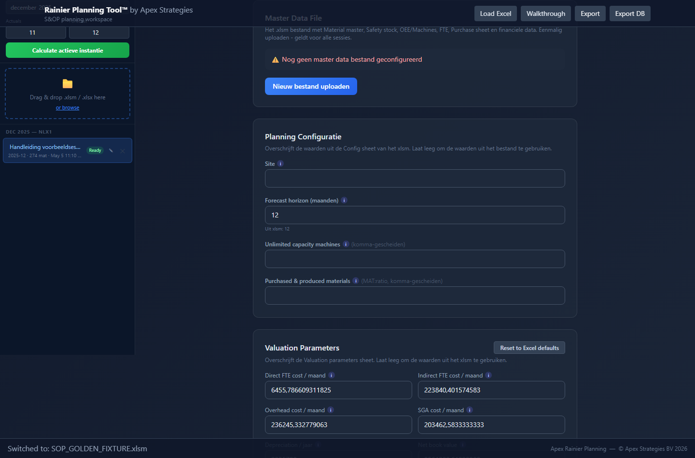

Belangrijk:

- Controleer dat de juiste planning month en horizon worden gebruikt.
- Bij een losse Forecast upload moet in het forecastbestand een `@` als anker
  aanwezig zijn. De parser gebruikt dit anker om de forecasttabel betrouwbaar
  te vinden; zonder dit anker kan de verkeerde tabel of kolom worden opgepakt.
- Controleer na berekening of de actieve sessie links zichtbaar is.
- Gebruik per klant/cyclus een herkenbare sessienaam.

### Forecast `@`-anker

Plaats het `@`-anker linksboven van de forecastsectie: in de cel direct links
van `YearMonth` en direct boven de product-/forecastregels. De tabel mag in het
Excelbestand verschoven zijn; zolang het `@`-anker op deze relatieve positie
staat, kan de parser de juiste forecastsectie vinden.

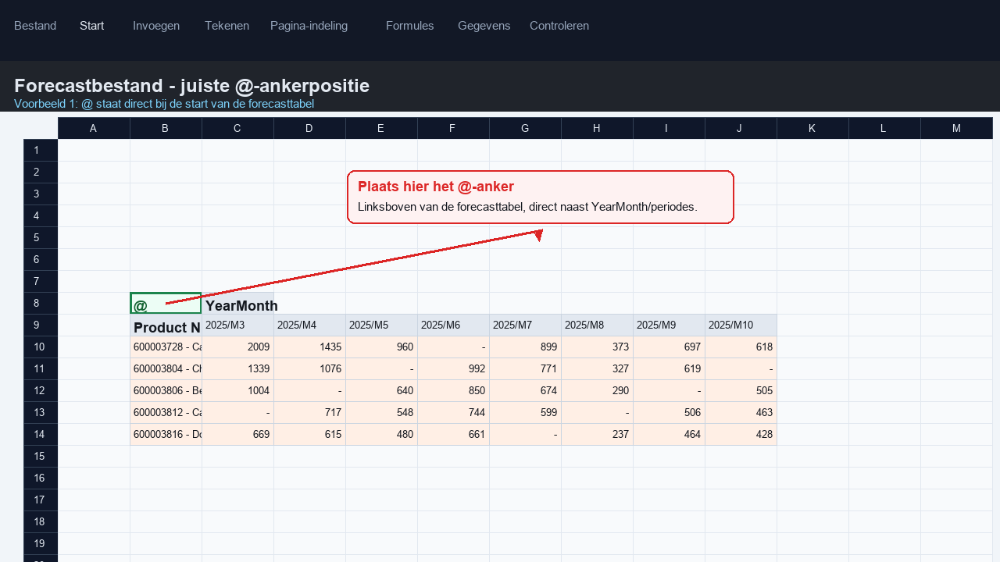

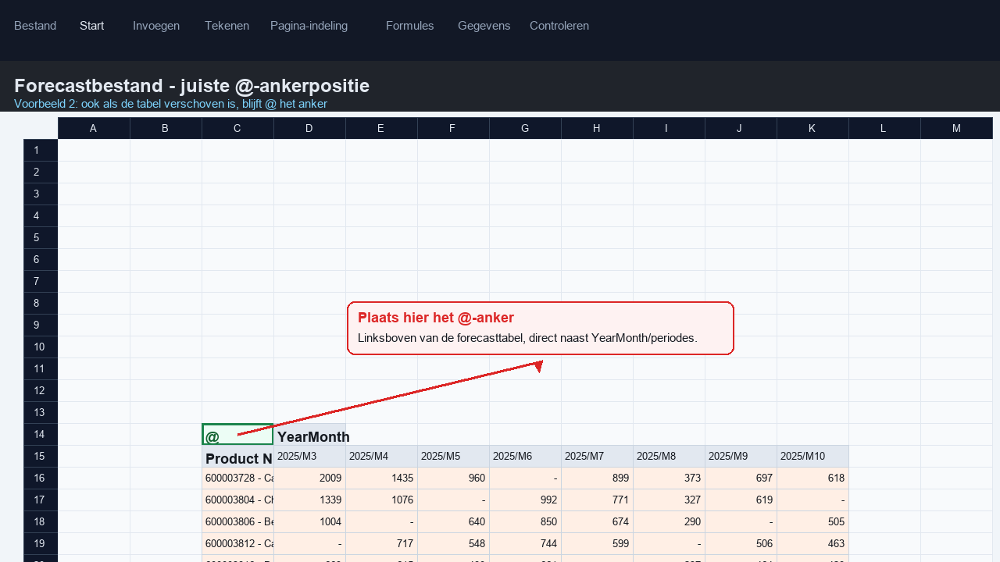

## 3. Dashboard

Het dashboard geeft een managementoverzicht van de berekening:

- actieve SKU's
- gemiddelde utilization
- totale FTE
- inventory value
- total demand
- financial metrics
- inventory quality
- top overstocks
- ROCE
- utilization en FTE charts

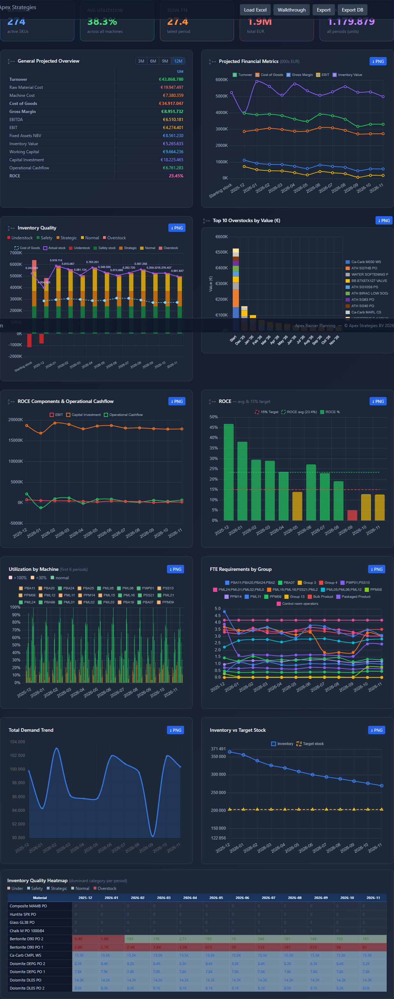

Gebruik dit scherm vooral voor snelle validatie na een calculate of na grote
edits. Als een planning edit impact heeft op capaciteit of waarde, horen de
grafieken hier mee te veranderen.

## 4. Planning tab

De Planning tab toont de volumeplanning per materiaal en line type. De
belangrijkste lijnen zijn onder andere:

- `01. Demand forecast`
- `03. Total demand`
- `04. Inventory`
- `05. Minimum target stock`
- `06. Production plan`
- `06. Purchase receipt`
- `07. Capacity utilization`
- `09. Available capacity`
- `10. Utilization rate`
- `11. Shift availability`
- `12. FTE requirements`

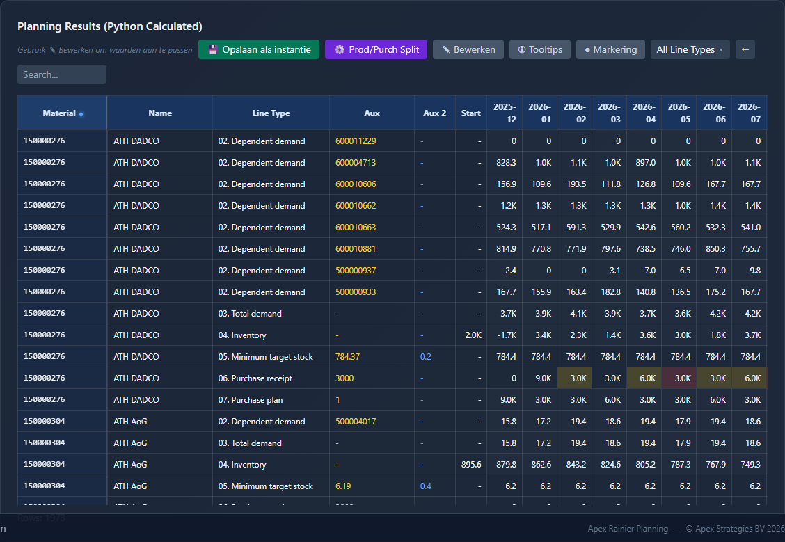

Gebruik filters, zoeken en line type-selectie om snel naar een materiaal of
lijn te gaan.

### Sorteren op grootte

De Planning- en Values Planning-tabellen kunnen op grootte worden gesorteerd.
Klik op het sorteerpijltje in een kolomkop (een maandkolom of de
`Start`-kolom): de eerste klik sorteert aflopend (grootste waarde bovenaan), de
tweede klik oplopend en de derde klik zet de standaardvolgorde terug.

- Kies via de **line type-filter** welke regel "grootte" bepaalt. Filter je
  bijvoorbeeld op `01. Demand forecast` en sorteer je een maandkolom, dan staan
  de materialen met de hoogste vraag in die maand bovenaan.
- Standaard worden de rijen los gesorteerd (zoals in Values Planning). Zet het
  vinkje **Groepeer materiaal** aan om alle regels van een materiaal bij elkaar
  te houden en de materiaalblokken te rangschikken.

## 5. Planning edits

Zet **Edit mode** aan om cellen aan te passen. Editable cellen krijgen een
visuele edit-indicator. Na een edit worden downstream resultaten opnieuw
berekend.

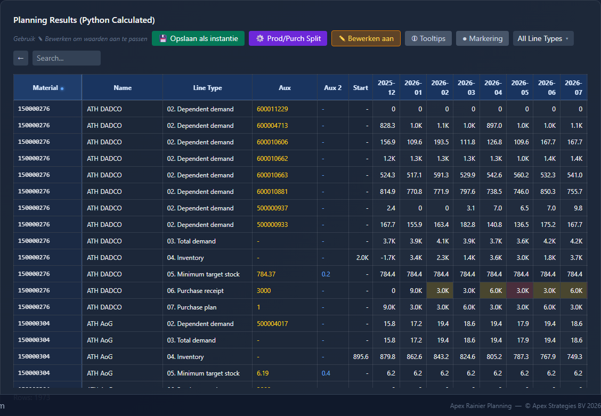

Voorbeelden van editgedrag:

- Demand forecast edits werken door naar total demand, inventory, productie,
  capaciteit en values.
- L4 Inventory is alleen editable op de `Start` / starting stock cel.
- L7, L9, L11 en L12 zijn editable voor capacity/FTE planning.
- L10 Utilization rate is niet direct editable; deze wordt afgeleid uit L7/L9.

Gebruik **Undo**, **Redo** en **Reset edits** om wijzigingen te beheren.

## 6. Machines / Capacity tab

De Machines tab toont capaciteit, utilization, OEE, availability, FTE en
heatmaps. Dit is het belangrijkste scherm voor capacity review.

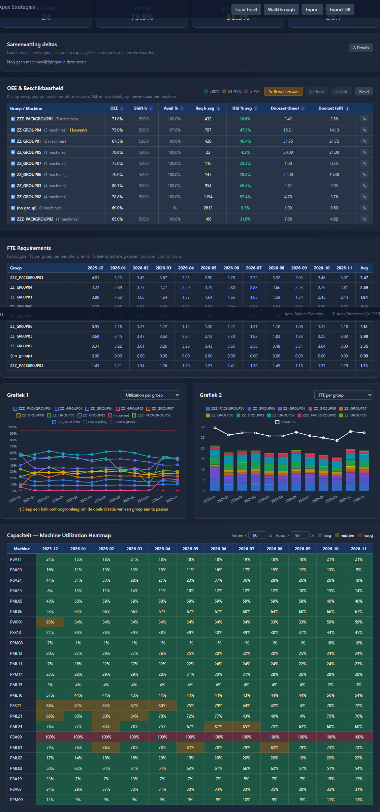

Gebruik dit scherm om te controleren:

- welke machines of groepen overbelast zijn
- of OEE/availability edits correct doorwerken
- of heatmapkleuren logisch reageren op threshold-instellingen
- of FTE en utilization charts overeenkomen met de planning
- of parameters bewerken om zo de invloeden te zien op de productie

## 7. Values Planning

Values Planning vertaalt volumes naar financiële effecten zoals omzet,
grondstofkosten, machinekosten, FTE-kosten, gross margin, EBITDA, EBIT en ROCE.

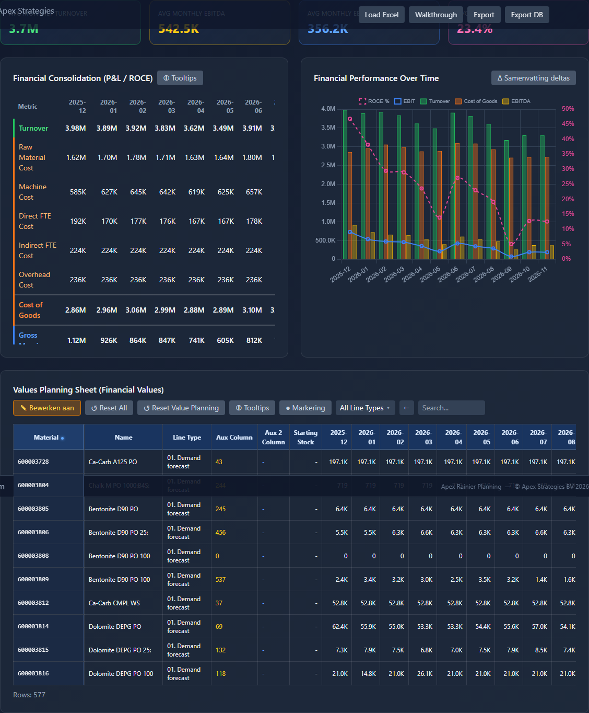

Gebruik dit scherm om te controleren:

- omzetimpact van demand edits
- raw material cost bij total demand
- inventory value
- purchase receipt cost
- machine cost uit capacity utilization
- direct FTE cost uit L12

Waar toegestaan kunnen financiële factoren via editable aux-velden worden
aangepast.

## 8. Inventory

De Inventory tab geeft inzicht in voorraadpositie, target stock en
inventory-quality categorieën.

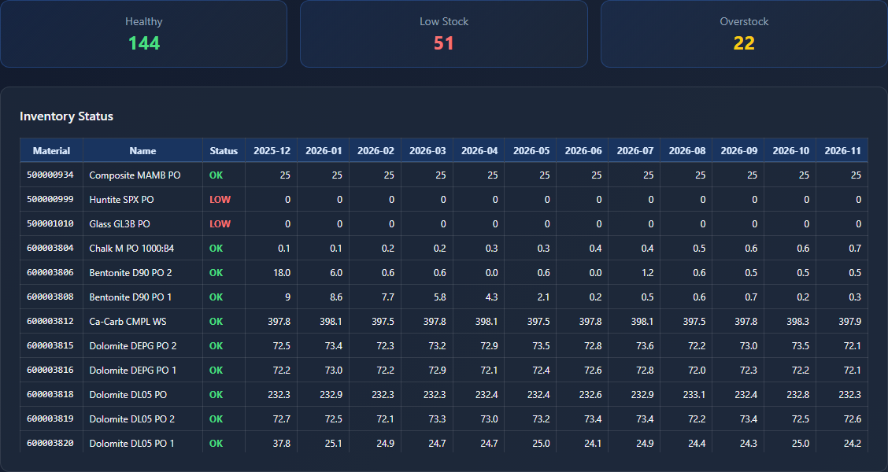

Gebruik dit scherm om te valideren:

- inventory versus target stock
- understock, safety, strategic, normal en overstock
- impact van demand, production, purchase en starting stock edits

## 9. MoM (Month-over-Month)

De MoM tab vergelijkt de **inventory startvoorraad** met een doelmaand verderop
in de horizon. Zo zie je in één oogopslag waar de voorraad in de loop van de
planperiode oploopt of afbouwt, en welke materialen de grootste beweging maken.

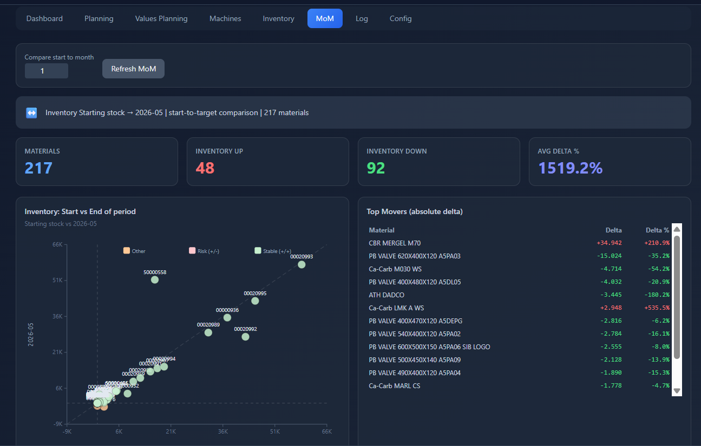

Bovenaan staan de bedieningselementen:

- **Compare start to month** — kies hoeveel maanden vooruit (1–24) je de
  startvoorraad wilt vergelijken. De statusbalk eronder toont de gekozen
  vergelijking, bijvoorbeeld `Inventory Starting stock → 2026-05`.
- **Refresh MoM** — herberekent de vergelijking met de ingestelde waarde.

De vier KPI-kaarten:

- **Materials** — aantal materialen in de vergelijking.
- **Inventory up** — aantal materialen waarvan de voorraad stijgt (in rood:
  meer voorraad).
- **Inventory down** — aantal materialen waarvan de voorraad daalt (in groen:
  minder voorraad).
- **Avg delta %** — gemiddelde procentuele voorraadverandering.

Daaronder:

- **Inventory: Start vs End of period** — een spreidingsgrafiek van de
  startvoorraad (x-as) tegen de doelmaand (y-as). Punten boven de diagonaal
  betekenen voorraadgroei, eronder afbouw.
- **Top Movers (absolute delta)** — de materialen met de grootste absolute
  voorraadverandering, met delta en delta %.
- **Period-over-Period Detail** — een detailtabel met per materiaal de
  start- en eindvoorraad, de delta en de delta %.

De detailtabel is sorteerbaar: klik op een kolomkop om op die kolom te
sorteren, en klik nogmaals om de richting om te keren (▲ oplopend / ▼ aflopend).
Sorteer bijvoorbeeld op **Delta** of **Delta %** om de grootste voorraad­bewegingen
bovenaan te zetten. Met het zoekveld rechtsboven filter je op materiaalnummer of
-naam.

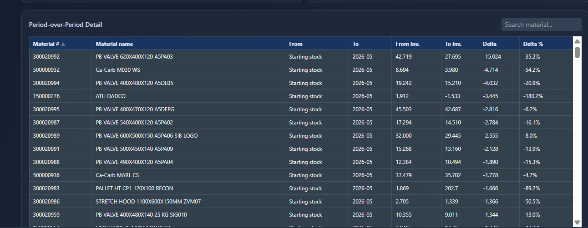

Gebruik dit scherm om te valideren:

- waar voorraad gedurende de horizon op- of afbouwt
- welke materialen de grootste voorraadbeweging veroorzaken
- of edits in demand, production of purchase het verwachte voorraadeffect hebben

> Let op: deze tab vergelijkt binnen de huidige planning (start versus
> doelmaand). De **MoM Comparison** in de Excel-export vergelijkt daarentegen
> met een vorige-cyclus snapshot (zie sectie 12).

## 10. Config

De Config tab bevat instellingen voor bestanden, folders en rekenparameters.

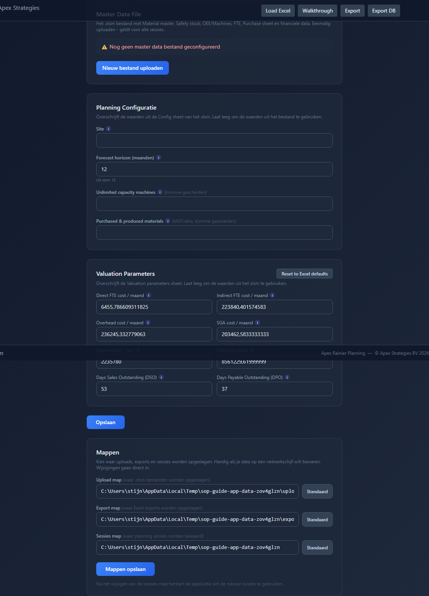

Belangrijk:

- Wijzig folderinstellingen alleen bewust.
- Controleer master file en extract files vóór multi-file uploads.
- Controleer bij Forecast extract files altijd dat het `@`-anker aanwezig is,
  zodat de parser de juiste forecastsectie gebruikt.
- PAP / purchased-and-produced instellingen zijn overrides en horen bewust per
  sessie of configuratie te worden beheerd.

## 11. Sessies

Links in de applicatie staat de sessielijst. Hiermee kunnen meerdere planning
instances naast elkaar worden bewaard, hernoemd, geopend of verwijderd.

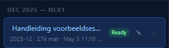

Gebruik sessies bijvoorbeeld voor:

- baseline versus scenario
- verschillende uploadversies
- tijdelijke analyse
- bewaren van een set edits voor later review


## 12. Export

Gebruik **Export** voor de planning workbook output en **Export DB** voor de
database-exportstructuur.

Controlepunten na export:

- Planning sheet bevat volumes.
- Values Planning sheet bevat financiële resultaten.
- FTE requirements sheet is aanwezig.
- High-level overview bevat grafieken.
- MoM Comparison wordt gevuld wanneer er een previous-cycle snapshot is.
- Exportbestanden komen in de ingestelde exports folder terecht.

